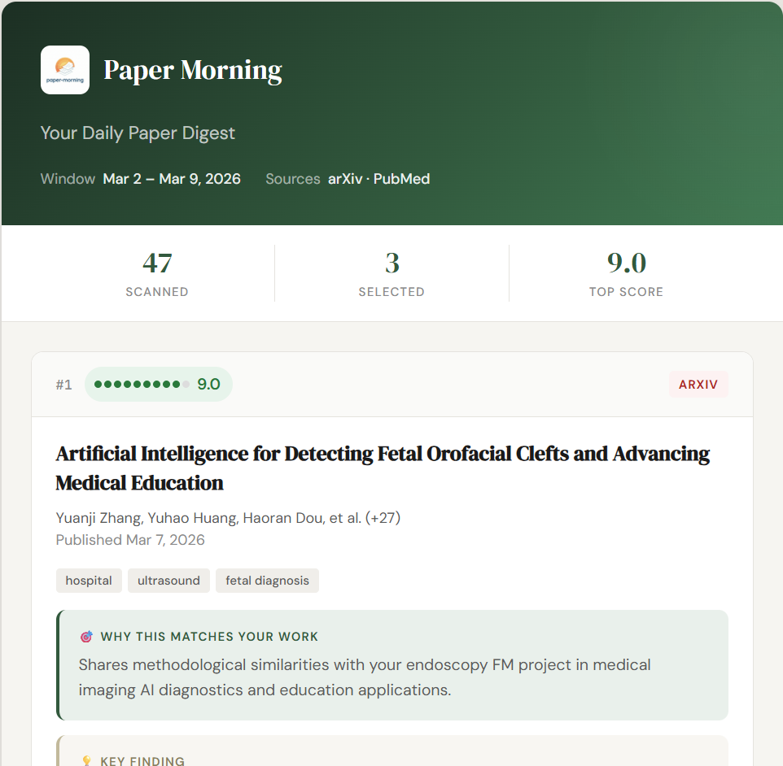

# Paper Morning

[](https://raw.githack.com/jeong87/paper-morning/main/docs/demo/index.html)

Paper Morning is an automated paper briefing tool for medical/health AI researchers.
It fetches recent papers, ranks relevance with LLM + project context, and sends a concise email digest.

- Latest version: **[v0.5.1](VERSION)**
- License: `GNU AGPLv3` ([LICENSE](LICENSE))
- Privacy policy: [PRIVACY.md](PRIVACY.md)

## Template sample
<a href="https://raw.githack.com/jeong87/paper-morning/main/docs/demo/index.html">Open Template sample</a>

## Try Web Preview (No Download)
If you want to test the digest style in browser first:

- <a href="https://raw.githack.com/jeong87/paper-morning/main/docs/preview/index.html">Open Web Preview</a>

What it does:
- Enter project info + Gemini API key
- Generates a digest-like preview
- Opens email-style HTML in a new browser tab

Notes:
- Client-side only (runs in your browser)
- No actual email is sent from this page
- Use this as a quick quality check before local install

## What It Does
1. Reads your project context and saved search queries.
2. Collects papers from arXiv, PubMed, Semantic Scholar, and optional Google Scholar (SerpAPI).
3. Scores each paper (1-10) with LLM relevance ranking.
4. Sends only high-relevance papers with short summaries by email.

## Key Features
- Personalized LLM relevance ranking using your active projects.
- Configurable cadence: `daily`, `every_3_days`, `weekly`.
- Duplicate suppression with history tracking (`sent_ids.json`).
- PubMed 429 retry/backoff handling.
- Gemini with automatic fallback (`3.1-pro` -> `3.1-flash` -> `2.5-flash`) and optional Cerebras backup.
- Output language control via `.env`:
  - `OUTPUT_LANGUAGE=en|ko|ja|es|...`

## Quick Start
- Beginner (English): [docs/manuals/MANUAL_FIRSTTIME_EN.md](docs/manuals/MANUAL_FIRSTTIME_EN.md)
- Full operations (English): [docs/manuals/MANUAL_EN.md](docs/manuals/MANUAL_EN.md)
- Beginner (Korean): [docs/manuals/MANUAL_FIRSTTIME_KR.md](docs/manuals/MANUAL_FIRSTTIME_KR.md)
- Full operations (Korean): [docs/manuals/MANUAL_KR.md](docs/manuals/MANUAL_KR.md)

## Recommended First Path (Preview-First, Local)
Generate your first personalized digest preview before email/automation setup.

1. Install dependencies:

```bash
pip install -r deps/requirements.txt
```

2. Run web console:

```bash
python app/web_app.py --host 127.0.0.1 --port 5050
```

3. Open `http://127.0.0.1:5050/setup`.
4. Fill project description + Gemini key, then click `Save and Preview Now`.

This verifies product value first without Gmail or GitHub Actions setup.

## GitHub Actions Mode (Advanced Automation)
Use this after preview quality is confirmed.

Required workflow files:
- `.github/workflows/paper-morning-digest.yml`
- `.github/workflows/paper-morning-bootstrap-topics.yml`

Required secrets:
- `PM_ENV_FILE` (full `.env` content)

Optional secret:
- `PM_TOPICS_JSON` (full `user_topics.json` content)
- `PM_PROJECTS_JSON` (project list only, for bootstrap query generation)

Tracked non-secret config:
- `config/projects.yaml` (project descriptions used for bootstrap/default onboarding)

## Important Settings
- `ONBOARDING_MODE`: `preview` (default) or `daily`.
- `SEND_FREQUENCY` / `SEND_ANCHOR_DATE`: cadence policy.
- `LOOKBACK_HOURS`: search window length.
- `LLM_MAX_CANDIDATES`: prefilter cap for LLM scoring.
- `OUTPUT_LANGUAGE`: summary language for LLM-generated reason/core/usefulness text.
- `ENABLE_GOOGLE_SCHOLAR` + `GOOGLE_SCHOLAR_API_KEY`: optional SerpAPI source.

## Local Web Console
Main path for onboarding and preview-first setup:

```text
http://127.0.0.1:5050
```

## Build Distribution Files
### Windows
```powershell
.\tools\build_windows.ps1
```

### Linux
```bash
chmod +x tools/build_linux.sh
./tools/build_linux.sh
```

## Demo Pages Deployment
This repo includes:
- demo generator script: `scripts/generate_demo_html.py`
- pages workflow: `.github/workflows/deploy-demo-pages.yml`

To publish demo on your fork:
1. Enable GitHub Pages source as **GitHub Actions**.
2. Run `deploy-demo-pages` workflow (or push to `main`).

Repo settings TODO (outside code):
- Fill GitHub About fields (`description`, `website`, `topics`).
- Publish the first tagged GitHub Release.

## Template-First Repository Setup
For global onboarding, prefer:
- `Use this template` -> create your own repository instance

Fallback (advanced):
- fork workflow if you explicitly need upstream fork linkage.

## Actions Cost Note (Private Repos)
- GitHub Free private repos include limited Actions minutes.
- If your workflow runs frequently (for example every 15 minutes), usage can exceed free minutes.
- Local-first preview and local scheduling are recommended for cost-safe onboarding.

## Troubleshooting (Quick)
- `Search query is empty`: generate and save topics/queries in Topic Editor.
- `PubMed 429`: retries are automatic, but adding `NCBI_API_KEY` is recommended.
- `Gemini model 404`: use a supported model (`gemini-3.1-pro` or `gemini-3.1-flash`).
- No email received: check sender/recipient addresses, spam folder, and auth config.

## Authentication Priority
1. Gmail App Password (current default for public beta users)
2. Google OAuth (intentionally hidden in default UI path until public rollout is ready)

Gmail app password docs:
- https://myaccount.google.com/apppasswords

## Documentation
- Beginner (English): [docs/manuals/MANUAL_FIRSTTIME_EN.md](docs/manuals/MANUAL_FIRSTTIME_EN.md)
- Full operations (English): [docs/manuals/MANUAL_EN.md](docs/manuals/MANUAL_EN.md)
- Beginner (Korean): [docs/manuals/MANUAL_FIRSTTIME_KR.md](docs/manuals/MANUAL_FIRSTTIME_KR.md)
- Full operations (Korean): [docs/manuals/MANUAL_KR.md](docs/manuals/MANUAL_KR.md)
- Korean README (legacy): [docs/manuals/README_KR.md](docs/manuals/README_KR.md)

## Contact
- nineclas@gmail.com
